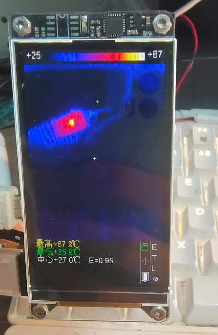
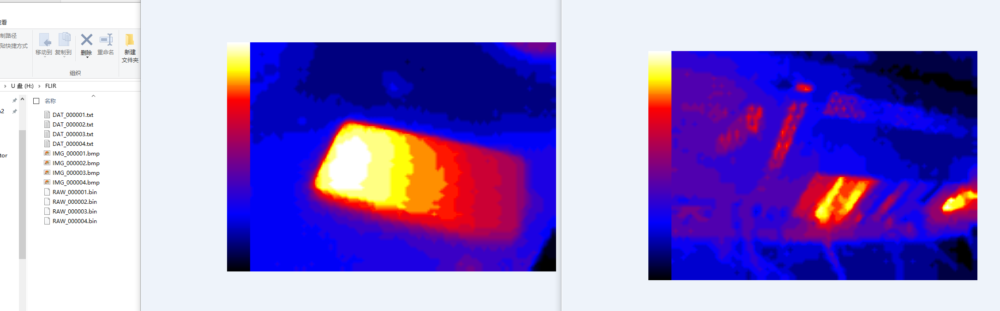
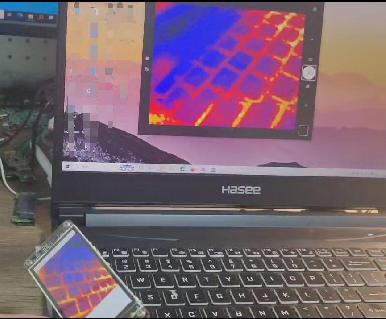
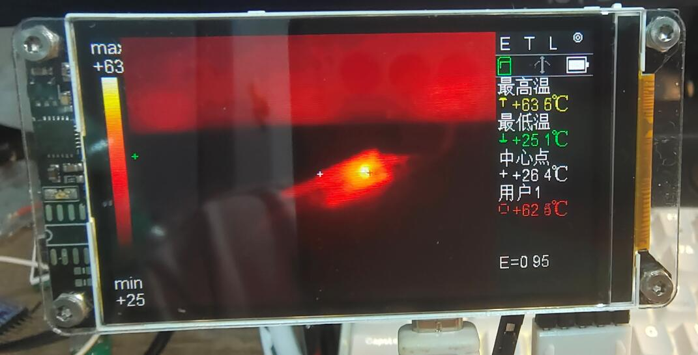
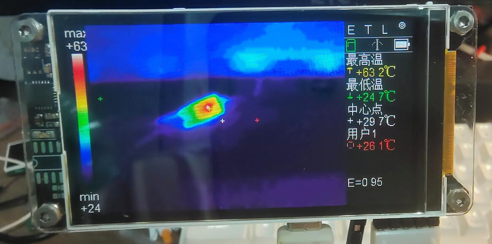
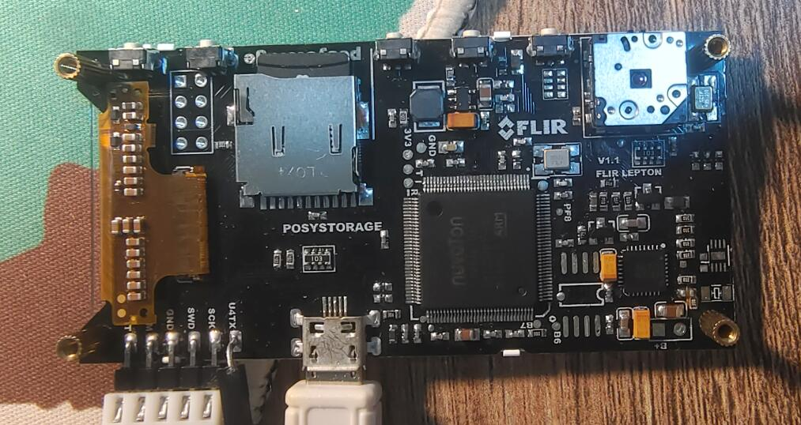

# FLIR LWIR 手持热成像仪硬件开源说明

<p align="center">
  <a href="#中文">中文</a> · <a href="#english">English</a>
</p>

## 中文

> 这是一份偏硬件与产品展示的开源说明。软件/固件说明请见：[`../readme.md`](../readme.md)。  
> 两份文档计划发布在不同平台，正式发布后建议把这里的相对链接替换为对应平台的公开链接。

### 项目简介

一个基于FLIR lepton 2.0热成像摄像头模块 和 Nuvoton M484KIDIE单片机 的手持式长波红外热成像仪硬件项目。硬件设计时间为 2019 年，挖坑后由于搞不定有效的可以跑在单片机上的图像超分辨率算法而弃坑，最近借着vibe coding热潮，可以向ai许愿了遂填坑。

目前实现了热图显示、拍照保存、USB 摄像头、SD 卡读写、姿态旋转 UI、电池和电源管理等功能。

请注意：这个硬件更多是一个历史设计，不建议直接复刻。板上使用了不少今天已经不容易采购、甚至偏过时的器件（比如屏幕直接买不到了，单片机和电源管理芯片不知道当时脑子发什么疯选的这玩意儿）；作者也不计划再做第二版。如果考虑复刻，应把它作为参考设计，而不是直接照抄 Gerber/BOM。

### 功能展示

#### 热成像显示

设备使用 FLIR Lepton 长波红外模组采集 80x60 RAW14 热图，MCU 端完成 AGC、灰度超分、伪彩色 LUT 和测温点叠加后，显示到 240x432 RGB LCD 上。




#### 拍照模式

主界面按下快门键后，固件会在 SD 卡的 `FLIR` 目录中保存三类文件：

- `IMG_xxxxxx.bmp`：344x240 BMP，包含左侧 LUT 色条和 320x240 热图，不包含右侧状态 UI。
- `RAW_xxxxxx.bin`：当前 80x60 RAW14 原始热数据。
- `DAT_xxxxxx.txt`：当前 LUT、发射率、帧号和测温点等元数据。

保存时会冻结当前帧，避免 BMP/RAW 写入过程中图像缓存被下一帧覆盖。




#### USB 摄像头模式

通过高速 USB 连接电脑后，设备会枚举为 USB 复合设备：

- UVC 摄像头：320x240 YUY2 热成像视频流。
- MSC 读卡器：电脑可访问 SD 卡内容。

画面优先保证板端 LCD 刷新流畅，因此 UVC 是 best-effort 发送。如果 USB 发送来不及完成，固件可能丢弃当前 USB 帧，以便继续处理和显示下一帧热图。

注意，不要让主机把设备降级到全速 USB，否则可能一张图像都发不出去。即使在高速 USB 下也已经很紧张：因为内存空间紧张，没有做完整双缓存，现处理出来的内容只能当场喂给 USB，图像处理本身也需要时间。



#### 不同 LUT 色卡效果





#### 硬件焊接展示



#### 图像超分辨率

80x60 的显示分辨率实在是没眼看，所以项目里跑了一个简易的图像超分辨率算法。

Lepton 模块支持输出彩图，也支持输出 RAW14 原始数据。如果直接对彩图做超分辨率，单片机冒烟都算不出来。所以当前方案先读取 RAW14，把原始数据 AGC 到 8-bit，然后在灰度热图上做超分辨率，最后再上色。

实现路径：

```text
80x60 RAW14
  -> 512-bin AGC 得到 80x60 Gray8
  -> 两级 2x 灰度超分得到 320x240 Gray8
  -> 查 LUT 输出 RGB565 到 LCD / 生成 BMP
```

第一级 2x 使用方向感知、受限 Catmull-Rom 中点插值，第二级使用双线性/平均，最后做轻量的受限锐化。经过测试，如果使用面向彩色图像的那种锐化，锐化会太严重，画面显得很假。

曾经尝试过在单片机上跑一个超小型神经网络算法，还专门收集了热成像训练图，PC 端也简单训练试了试；后面发现 SRAM 消耗太多，算力也跟不上，这个坑后续有机会再填吧。

传统算法在 Cortex-M4 上比较节省资源，整个图像扩展流程大概 75ms 算完，也比较适合热扩散图像的观感。

<!-- 功能展示图：最近邻 4x 与两级 2x 超分效果对比 -->

### 关键硬件

| 模块 | 关键器件/接口 | 说明 |
|---|---|---|
| 主控 | Nuvoton M484KIDIE | Cortex-M4F，系统时钟 192MHz。 |
| 红外模组 | FLIR Lepton 系列 | 当前固件按 Lepton 2.0 RAW14/VoSPI/CCI 80x60 路径整理；更换型号需核对 CCI 命令和输出格式。 |
| 显示 | 240x432 RGB LCD | 主控 S6D0170，EBI 并行接口，RGB565。 |
| 电源管理 | LP3921 PMIC + 1.2V DCDC | 为 MCU、LCD/SD、Lepton 模拟/IO/数字核心供电，并负责充电/电源保持。 |
| 姿态 | MPU6050 | 用于 0/90/180/270 度方向判定和 UI 旋转。 |
| 存储 | microSD + SDH1 | 4-bit SD 总线，FatFS 文件系统。 |
| USB | M484 HS USB | 固件实现 UVC 摄像头和 MSC 读卡器复合设备。 |
| 人机交互 | 5 个顶部按键 | 开关机、发射率选择、测温点、LUT 切换、确认/快门。 |
| 调试 | UART4 | 921600bps 调试输出。 |

### 未焊接/未实现的预留器件

电路板上预留了若干器件位，但当前样机没有焊接，也没有配套软件驱动，可以不焊：

- `24C02` EEPROM：未焊接，设置存储功能暂未实现。
- `W25Q32` SPI Flash：未焊接，当前固件暂时用不到外部 Flash；倒是可以考虑接一个 PSRAM，跑一点更炫酷的图像算法。
- `RX8010` RTC：未焊接，当前文件命名使用递增序号，实时时钟功能已搁置。
- `SHT30` 温湿度传感器：未焊接，这个位置离电源管理芯片太近，而电源管理芯片又很烫，测出来的环境温度不准，越测越假。
- `ESP-01 WiFi` 模块：未焊接，WiFi 功能已搁置。

### 已知硬件问题

调试期间发现了几个比较实际的问题：

- 摄像头位置太靠近板边。手持或调试时手容易碰到 Lepton 模组，导致模组与座子接触不良。
- 主控芯片和电源管理芯片发热较明显，而且非常靠近板载温度计预留位。
- 发热器件也离摄像头比较近，会影响红外测温精度和稳定性。
- 因为热干扰比较明显，最终没有安装板载温度计。

如果要复刻，屏幕肯定要换掉；主控建议换成带 HS USB、主频和 SRAM 都更充裕的型号，以缓解当前超分输出、中间缓存和 USB/SD 双缓冲带来的内存紧张问题。这里推荐直接考虑 GD32H757。至少也应修改摄像头位置、热源器件布局、温度传感器位置和热隔离结构。不要直接复刻当前布局。

### 软件与验证状态

固件已经实现了主循环调度、图像处理、UI、存储、USB 复合设备等大量功能，但仍有不少内容需要仔细复核。项目中有大量 vibe coding 内容，目前只测试了 happy path，代码使用前最好逐项核对。

### 复刻建议

这个硬件设计不是推荐量产方案。若只是学习，可以参考电源、Lepton、LCD、SD、USB 等模块的组织方式；若要做新板，建议重新选型并重新布局。

作者目前不打算推出第二版硬件。

## English

> This document focuses on hardware and product-level presentation. For the software/firmware notes, see [`../readme.md`](../readme.md).  
> The hardware and software documents are intended for different publishing platforms; after publication, replace these relative links with the public URLs.

### Overview

This is a handheld long-wave infrared thermal imager hardware project based on the FLIR Lepton 2.0 thermal camera module and the Nuvoton M484KIDIE MCU. The hardware was designed in 2019. I dug this hole and then abandoned it because I could not make an effective image super-resolution algorithm run on a microcontroller. Recently, with the vibe-coding wave, I can finally make wishes to AI, so I came back to fill the hole.

The current system implements thermal image display, photo capture, USB camera mode, SD-card access, orientation-aware UI rotation, battery management, and power management.

Please note that this hardware is more of a historical design and is not recommended for direct reproduction. Many components on the board are now hard to source or outdated. For example, the screen basically cannot be bought directly anymore, and I have no idea what was going through my head when I chose this MCU and PMIC. The author does not plan to make a second hardware revision. If you are considering reproducing it, treat it as a reference design rather than directly copying the Gerber files or BOM.

### Feature Demo

#### Thermal Image Display

The device uses a FLIR Lepton long-wave infrared module to capture 80x60 RAW14 thermal frames. The MCU performs AGC, grayscale super-resolution, pseudo-color LUT mapping, and temperature-point overlay, then displays the result on a 240x432 RGB LCD.


#### Photo Mode

After pressing the shutter key on the main screen, the firmware saves three types of files into the `FLIR` directory on the SD card:

- `IMG_xxxxxx.bmp`: a 344x240 BMP containing the left LUT strip and the 320x240 thermal image, without the right-side status UI.
- `RAW_xxxxxx.bin`: the current 80x60 RAW14 thermal data.
- `DAT_xxxxxx.txt`: metadata such as current LUT, emissivity, frame number, and temperature points.

The current frame is frozen during saving, so the BMP/RAW write process will not be corrupted by the next frame overwriting the image buffer.


#### USB Camera Mode

When connected to a PC through high-speed USB, the device enumerates as a USB composite device:

- UVC camera: 320x240 YUY2 thermal video stream.
- MSC card reader: the PC can access the SD card.

The firmware prioritizes smooth LCD refresh on the device, so UVC streaming is best-effort. If USB transmission cannot finish in time, the firmware may drop the current USB frame so it can continue processing and displaying the next thermal frame.

Do not let the host downgrade the device to full-speed USB, or it may fail to transmit even one full image. Even under high-speed USB, the timing is already tight: because RAM is limited, there is no full double buffering, so newly processed image data must be fed to USB immediately while image processing itself also consumes time.


#### Different LUT Palette Effects


#### Hardware Soldering Showcase


#### Image Super-Resolution

The native 80x60 display resolution is painfully low, so this project runs a simple image super-resolution algorithm.

The Lepton module can output both pseudo-color images and RAW14 data. If super-resolution is applied directly to the color image, the MCU would never keep up. The current approach reads RAW14 first, maps it to 8-bit grayscale through AGC, performs super-resolution on the grayscale thermal image, and applies color afterward.

Pipeline:

```text
80x60 RAW14
  -> 512-bin AGC to 80x60 Gray8
  -> two-stage 2x grayscale super-resolution to 320x240 Gray8
  -> LUT lookup to RGB565 for LCD / BMP generation
```

The first 2x stage uses direction-aware, limited Catmull-Rom midpoint interpolation. The second stage uses bilinear/average interpolation, followed by light limited sharpening. Tests showed that sharpening methods intended for color images look too harsh and fake on thermal images.

There was also an attempt to run a tiny neural-network algorithm on the MCU. Thermal training images were collected, and a simple PC-side training experiment was done. In the end, SRAM usage and compute cost were too high, so that idea is left for the future.

The traditional algorithm is much more resource-friendly on Cortex-M4. The whole image expansion process takes about 75ms and also looks more natural for heat-diffusion imagery.

<!-- Demo image: nearest-neighbor 4x vs two-stage 2x super-resolution comparison -->

### Key Hardware

| Module | Key component/interface | Notes |
|---|---|---|
| MCU | Nuvoton M484KIDIE | Cortex-M4F, 192MHz system clock. |
| Infrared module | FLIR Lepton series | Current firmware is organized around the Lepton 2.0 RAW14/VoSPI/CCI 80x60 path. Other models require checking CCI commands and output formats. |
| Display | 240x432 RGB LCD | S6D0170 controller, EBI parallel interface, RGB565. |
| Power management | LP3921 PMIC + 1.2V DCDC | Powers MCU, LCD/SD, Lepton analog/IO/digital core, and handles charging and power hold. |
| Orientation | MPU6050 | Used for 0/90/180/270 degree orientation detection and UI rotation. |
| Storage | microSD + SDH1 | 4-bit SD bus with FatFS. |
| USB | M484 HS USB | Firmware implements a composite UVC camera and MSC card reader. |
| Interaction | 5 top buttons | Power, emissivity selection, temperature points, LUT switching, confirm/shutter. |
| Debug | UART4 | 921600bps debug output. |

### Unpopulated / Unimplemented Reserved Parts

Several footprints are reserved on the PCB, but they are not populated on the current prototype and have no software drivers. They can be left unmounted:

- `24C02` EEPROM: not populated; settings storage is not implemented.
- `W25Q32` SPI Flash: not populated; the current firmware does not need external Flash. This position could potentially be adapted for PSRAM to run more ambitious image algorithms.
- `RX8010` RTC: not populated; current file naming uses an incrementing sequence number, and real-time clock support is postponed.
- `SHT30` temperature/humidity sensor: not populated. Its position is too close to the PMIC, and the PMIC runs hot, so the measured ambient temperature would be inaccurate.
- `ESP-01 WiFi` module: not populated; WiFi support is postponed.

### Known Hardware Issues

Several practical issues were found during debugging:

- The camera is too close to the board edge. During handheld use or debugging, it is easy to touch the Lepton module, causing poor contact between the module and its socket.
- The MCU and PMIC produce noticeable heat and are very close to the reserved onboard thermometer position.
- These heat sources are also close to the camera and can affect infrared temperature accuracy and stability.
- Because the thermal interference was obvious, the onboard thermometer was ultimately not installed.

If you reproduce the design, the display should definitely be replaced. The MCU should preferably be replaced with a part that has HS USB and more CPU frequency and SRAM, to relieve the current memory pressure from super-resolution buffers and USB/SD buffering. GD32H757 is a direct candidate to consider. At minimum, change the camera position, heat-source layout, temperature-sensor position, and thermal isolation. Do not directly copy the current layout.

### Software and Verification Status

The firmware already implements main-loop scheduling, image processing, UI, storage, and USB composite-device functions. However, many parts still need careful review. The project contains a lot of vibe coding, and only the happy path has been tested so far. Review the code item by item before use.

### Reproduction Advice

This hardware design is not recommended as a production-ready design. For learning, it can be used as a reference for the power, Lepton, LCD, SD, and USB module organization. For a new board, choose newer components and redo the layout.

The author currently does not plan to make a second hardware revision.
