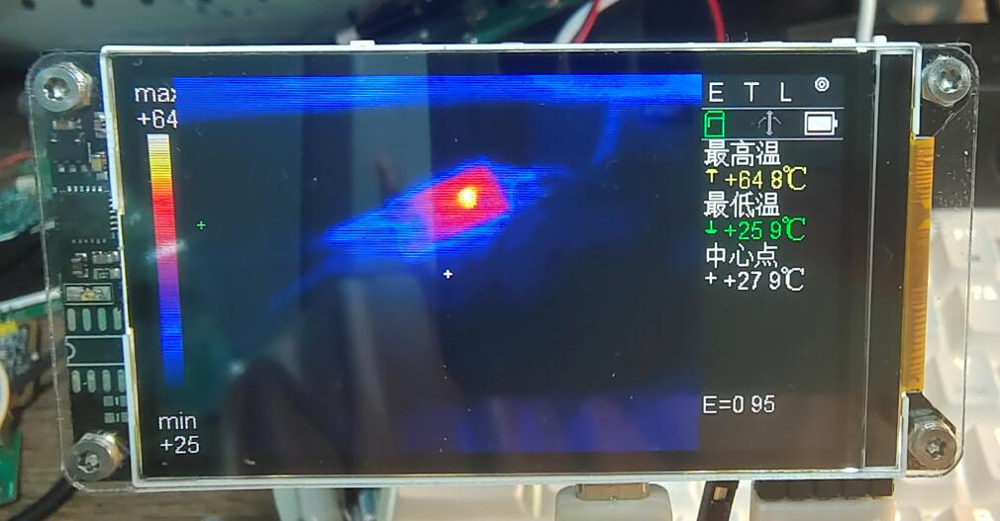
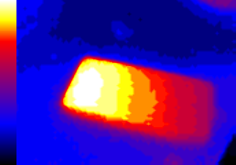

# FLIR LWIR Firmware README

<p align="center">
  <a href="#中文">中文</a> · <a href="#english">English</a>
</p>

## 中文

> 中文为原文，英文为机器翻译，仅供海外读者快速了解。  
> 硬件开源说明见：[`hardware/hw.md`](hardware/hw.md)。两份文档计划发布在不同平台，正式发布后建议把这里的相对链接替换为对应平台的公开链接。

### 项目简介

这是一个用于 FLIR Lepton 2.0 热成像摄像头模块的 MCU 固件项目，单片机基于 Nuvoton M484KIDIE，是一款 Cortex-M4F、192MHz 的主控。

目前功能包括：Lepton RAW14 热图采集、MCU 端图像增强（AGC、图像超分辨率）、LCD UI、HS USB 摄像头 + 读卡器、SD 卡拍照保存和电源管理。





Lepton 2.0 是一个 80x60 分辨率、不带测温功能的热成像摄像头模块，价格比较便宜。由于没有出厂校准的测温系数，本项目只能通过手算模型估算大致温度，可能需要二次校准才更接近真实值。建议把它作为相对温度变化的参考，而不是绝对测温仪器。

重要提醒：代码中有大量 vibe coding 内容，目前只测试了 happy path。虽然项目已经按现有文档和源码组织出完整框架，但使用、移植或复刻前必须仔细核对。

### 当前功能

- Lepton RAW14 采集，CCI 初始化和 VoSPI 帧读取。
- 512-bin Variant HEQ 风格 AGC。
- 80x60 到 320x240 的两级 2x 灰度超分。
- 支持多色卡 LUT，LCD 使用 RGB565 表，BMP 使用 RGB888 表，USB UVC 保留 YUV/灰度路径。
- RBFO 逆普朗克粗测温、发射率修正、中心/最高/最低/用户点测温。
- 432x240 手绘 UI：左侧 LUT、中间热图、右侧状态/菜单。
- MPU6050 姿态检测和 0/90/180/270 度 UI 适配。
- USB HS 复合设备：UVC 热成像摄像头 + MSC SD 读卡器。
- microSD + FatFS：保存 BMP/RAW/TXT。
- 电源管理：电池 ADC、充电状态、空闲/低电压关机、KEY1 长按关机。

### 软件架构

```text
USER/main.c
  -> SYS/       clock, tick, delay
  -> HARDWARE/  I2C, Lepton, LCD, SDH1, MPU6050, LP3921, key, UART
  -> APP/       image pipeline, UI, USB composite, UVC, storage, power manager
  -> thirdparty/fatfs/
```

主循环是裸机状态机调度，不使用 RTOS。对于一帧图像数据，当前约 8.5fps，图像处理流程约 75ms，LCD 显示约 15ms，还有约 30% 的处理器余量。HS UVC 上传仍然比较紧凑。

### 算法实现框架

图像处理分为显示链路和测温链路。AGC 只用于显示，不参与温度换算：

```text
Lepton RAW14[60][80]
  -> 显示链路: 512-bin AGC -> Gray8[60][80] -> 两级 2x 超分 -> Gray8[240][320]
  -> 测温链路: RBFO 逆普朗克 -> 发射率/校准 -> 测温点
```

超分算法位于 `firmware/APP/image_upscale.c`。它先在 80x60 灰度图上做方向感知 2x，得到 160x120；再用轻量 2x 得到 320x240；最后使用受限轻锐化。这样可以避免在伪彩色 RGB 空间插值产生色边，也能减轻普通最近邻 4x 的明显块状感。

图像流水线位于 `firmware/APP/image_proc.c`，按状态机分片推进超分，避免一次性长时间阻塞 USB、按键和 SD 服务。

### UI 框架

项目没有引入 LVGL 等通用 UI 框架，而是手绘 UI：

- `ui.c`：UI 状态机、按键分发、脏区调度。
- `ui_draw.c`：矩形、线、点阵图标、文字、LUT、RGB565 热图写屏。
- `ui_menu.c`：发射率、LUT、测温点菜单。
- `mcu_font.c` / `flir_font_16.c`：中英混合点阵字体。

UI 基础布局为 432x240：左侧 24px LUT 色条，中间 320x240 热图，右侧 88px 状态/菜单区。方向变化由 MPU6050 驱动触发，UI 在 0/90/180/270 度下重新计算 LUT 和状态栏位置。

### USB 和 SD 卡调度

USB 侧由 `usb_composite.c` 和 `usb_uvc.c` 实现：

- UVC：320x240 YUY2，图像源来自超分后的 Gray8。发送时即时生成 `Y0,128,Y1,128`，不申请整帧 YUY2 缓冲。
- MSC：把 SD 卡暴露为 USB Mass Storage。MSC 占用 SD 时，FatFS 会被释放，板端拍照保存被禁止。

SD 侧由 `sdcard.c` 提供插拔检测、挂载、异步块传输和 FatFS 接入。USB MSC 与 FatFS 通过 `SDCard_AcquireForMSC()` / `SDCard_ReleaseFromMSC()` 互斥，避免电脑和板端同时写同一张卡。

拍照保存由 `storage.c` 分片执行。保存 BMP 时每次写 4 行，并在保存期间暂停新热图处理，以保护 `g_sr_out` 和 RAW14 快照。

### 硬件注意

硬件设计时间是 2019 年，有大量今天不易采购的过时器件，更多仅供参考，不建议直接复刻。板上预留的 24C02、W25Q32、RX8010、SHT30、ESP-01 WiFi 模块均未焊接，也没有软件驱动，可以不焊接。后续若继续改板或继续改软件，可以考虑在 W25Q32 位置改接 PSRAM，以缓解当前内存紧张问题。

屏幕主控为 S6D0170，现在已经很难买到。如果要更换，建议换成 ST7789 主控的屏幕。

更完整的硬件说明见 [`hardware/hw.md`](hardware/hw.md)。

### 构建说明

项目使用 Keil MDK V6 编译器。

本 README 不代表已经在所有硬件条件下完成验证。若复刻，请先完整核对硬件、Keil 工程文件、启动文件、链接脚本和所有新增源码是否已经加入工程。

## English

> The Chinese section is the original text. This English section is machine translated and is provided only as a quick reference for non-Chinese readers.  
> Hardware documentation: [`hardware/hw.md`](hardware/hw.md). The hardware and software documents are intended for different publishing platforms; after publication, replace these relative links with the public URLs.

### Overview

This is an MCU firmware project for the FLIR Lepton 2.0 thermal camera module. The MCU is based on the Nuvoton M484KIDIE, a Cortex-M4F controller running at 192MHz.

The current firmware covers Lepton RAW14 thermal image acquisition, MCU-side image enhancement (AGC and image super-resolution), LCD UI, HS USB camera + card-reader mode, SD-card photo capture, and power management.


Lepton 2.0 is an inexpensive 80x60 thermal camera module without radiometric temperature measurement. Because it does not provide factory-calibrated temperature coefficients, this project can only estimate approximate temperatures through a hand-built model. Secondary calibration may be required for better accuracy. Treat it as a reference for relative temperature changes rather than an absolute thermometer.

Important warning: there is a lot of vibe coding in this codebase, and only the happy path has been tested so far. Although the project now has a complete framework based on the current documents and source code, everything must be carefully reviewed before use, porting, or reproduction.

### Features

- Lepton RAW14 acquisition, CCI initialization, and VoSPI frame reading.
- 512-bin Variant-HEQ-style AGC.
- Two-stage 2x grayscale super-resolution from 80x60 to 320x240.
- Multiple LUT palettes. LCD uses RGB565 tables, BMP uses RGB888 tables, and USB UVC keeps a YUV/grayscale path.
- RBFO inverse-Planck rough temperature estimation, emissivity correction, and center/max/min/user temperature points.
- Hand-drawn 432x240 UI: LUT on the left, thermal image in the center, status/menu panel on the right.
- MPU6050 orientation detection and 0/90/180/270 degree UI adaptation.
- USB HS composite device: UVC thermal camera + MSC SD-card reader.
- microSD + FatFS storage for BMP/RAW/TXT files.
- Power management: battery ADC, charge status, idle/low-voltage shutdown, and KEY1 long-press shutdown.

### Software Architecture

```text
USER/main.c
  -> SYS/       clock, tick, delay
  -> HARDWARE/  I2C, Lepton, LCD, SDH1, MPU6050, LP3921, key, UART
  -> APP/       image pipeline, UI, USB composite, UVC, storage, power manager
  -> thirdparty/fatfs/
```

The main loop is a bare-metal state-machine scheduler and does not use an RTOS. For each frame, the current effective rate is about 8.5fps. Image processing takes about 75ms, LCD output takes about 15ms, and roughly 30% CPU headroom remains. HS UVC transmission is still quite tight.

### Algorithm Framework

The image pipeline is split into a display path and a temperature path. AGC is used only for display and does not participate in temperature conversion:

```text
Lepton RAW14[60][80]
  -> display path: 512-bin AGC -> Gray8[60][80] -> two-stage 2x super-resolution -> Gray8[240][320]
  -> temperature path: RBFO inverse Planck -> emissivity/calibration -> temperature points
```

The super-resolution implementation is in `firmware/APP/image_upscale.c`. It first performs direction-aware 2x interpolation on the 80x60 grayscale image to generate 160x120, then uses a lighter 2x pass to produce 320x240, followed by limited light sharpening. This avoids color fringing from interpolation in pseudo-color RGB space and reduces the blocky look of ordinary nearest-neighbor 4x scaling.

The image pipeline is implemented in `firmware/APP/image_proc.c`. It advances super-resolution in slices through a state machine, avoiding long blocking periods that would otherwise affect USB, buttons, and SD-card service.

### UI Framework

The project does not use LVGL or another general-purpose UI framework. The UI is hand drawn:

- `ui.c`: UI state machine, key dispatch, dirty-region scheduling.
- `ui_draw.c`: rectangles, lines, bitmap icons, text, LUT, and RGB565 thermal-frame output.
- `ui_menu.c`: emissivity, LUT, and temperature-point menus.
- `mcu_font.c` / `flir_font_16.c`: mixed Chinese/English bitmap fonts.

The base UI layout is 432x240: a 24px LUT strip on the left, a 320x240 thermal image in the center, and an 88px status/menu panel on the right. Orientation changes are triggered by the MPU6050 driver, and the UI recalculates LUT and status-panel positions for 0/90/180/270 degree orientations.

### USB and SD Scheduling

USB is implemented by `usb_composite.c` and `usb_uvc.c`:

- UVC: 320x240 YUY2. The image source is the super-resolved Gray8 frame. The firmware generates `Y0,128,Y1,128` on the fly and does not allocate a full-frame YUY2 buffer.
- MSC: exposes the SD card as USB Mass Storage. When MSC owns the SD card, FatFS is released and local photo capture on the device is disabled.

The SD-card layer in `sdcard.c` handles card detection, mounting, asynchronous block transfers, and FatFS integration. USB MSC and FatFS are mutually exclusive through `SDCard_AcquireForMSC()` and `SDCard_ReleaseFromMSC()`, preventing the host PC and the device from writing to the same card at the same time.

Photo capture is implemented as a sliced state machine in `storage.c`. BMP saving writes four rows at a time, and new thermal-frame processing is paused during saving to protect `g_sr_out` and the RAW14 snapshot.

### Hardware Notes

The hardware was designed in 2019 and uses many components that are now outdated or hard to source. It is mainly provided as a reference and is not recommended for direct reproduction. The reserved 24C02, W25Q32, RX8010, SHT30, and ESP-01 WiFi module footprints are not populated and have no software drivers, so they can be left unmounted. If the board or software is developed further, the W25Q32 position could potentially be adapted for PSRAM to relieve the current memory pressure.

The LCD controller is S6D0170, which is now difficult to buy. If the display is replaced, an ST7789-based screen is recommended.

For more complete hardware notes, see [`hardware/hw.md`](hardware/hw.md).

### Build Notes

The project uses the Keil MDK V6 compiler.

This README does not mean that all functions have been fully verified under all hardware conditions. If you reproduce the project, first check the hardware, Keil project files, startup files, linker script, and whether all newly added source files have been included in the project.
